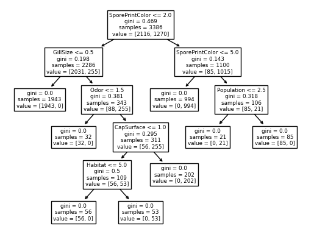
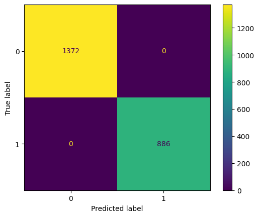
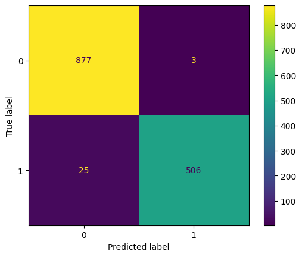
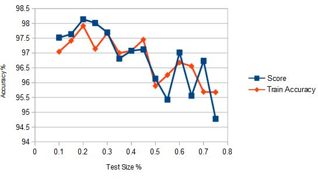

# Mushrooms_Poisonous or Edible
The purpose of this project is to compare and contrast two supervised machine learning algorithms, namely Decision Tree and Naive Bayes Classifier. Which algorithm will save us from eating a poisonous mushroom?

## Data Set
The [data set](https://archive.ics.uci.edu/dataset/73/mushroom), courtesy of UCI's Machine Learning Repository, contains 8,124 data points. Of these, 2,480 data points were missing an attribute and were excluded. Thus, the data set is composed of 5,644 data points. There are the following twenty-two attributes and the classification value listed below:
```
1. Cap shape = { bell, conical, convex, flat, knobbed, sunken }
2. Cap surface = { fibrous, grooves, scaly, smooth }
3. Cap color = { brown, buff, cinnamon, gray, green, pink, purple, red, white, yellow }
4. Bruises = { T, F }
5. Odor = { almond, anise, creosote, fishy, foul, musty, none, pungent, spicy }
6. Gill attachment = { attached, descending, free, notched }
7. Gill spacing = { close, crowded, distant }
8. Gill size = { broad, narrow }
9. Gill color = { black, brown, buff, chocolate, gray, green, orange, pink, purple, red, white, yellow }
10. Stalk shape = { enlarging, tapering }
11. Stalk root = { bulbous, club, cup, equal, rhizomorphs, rooted }
12. Stalk surface above ring = { fibrous, scaly, silky, smooth }
13. Stalk surface below ring = { fibrous, scaly, silky, smooth }
14. Stalk color above ring = { brown, buff, cinnamon, gray, orange, pink, red, white, yellow }
15. Stalk color below ring = { brown, buff, cinnamon, gray, orange, pink, red, white, yellow }
16. Veil type = { partial, universal }
17. Veil color = { brown, orange, white, yellow }
18. Ring number = { none, one, two }
19. Ring type = { cobwebby, evanescent, flaring, large, none, pendant, sheathing, zone }
20. Spore print color = { black, brown, buff, chcolate, green, orange, purple, white, yellow }
21. Population = { abundant, clustered, numerous, scattered, several, solitary }
22. Habitat = { grasses, leaves, meadows, paths, urban, waste, woods }
23. Classification = { edible, poisonous }
```

## Decision Tree Classification
SciKit-Learn informs us in their User Guide on [Decision Trees](https://scikit-learn.org/stable/modules/tree.html):
> "Decision Trees are a non-parametric supervised learning method used for classification and regression."

When building decision trees, we want to minimize the size of the tree as much as possible and maintain the highest purity. The impurity of a subnode can be determined with the Gini Index.


The Gini Index is calculated on every subnode of a given node. The maximum impurity a subnode can possess is 0.5, but we want 0 for an optimal decision tree.

## Naive Bayes Classification
According to SciKit-Learn's section on [Naive Bayes](https://scikit-learn.org/stable/modules/naive_bayes.html):
> "Naive Bayes methods are a set of supervised learning algorithms based on applying Bayes' theorem with the 'naive' assumption of conditional independence between every pair of features given the value of the class variable"


Given an input vector x, the goal of Naive Bayes is to predict an output label y that maximizes the probability of y occuring given x is true. This formula allows us to estimate the conditional probability of x<sub>i</sub> occuring given y<sub>j</sub> is true. The maximal probability will be chosen and will classify the new instance to y<sub>j</sub>.

## Experiment
Google's Colaboratory alongside the SciKit-Learn library was used to conduct the experiment. Linked below are the two notebooks containing the source code for the project.
- [Decision Tree](https://colab.research.google.com/drive/19hu9B4JnuzDUmCghqEgNRRIHaR5H7NDu)
- [Naive Bayes](https://colab.research.google.com/drive/1IUGzvvjpSgimgr6aWF98rmyj-xTQjPAW)

**Decision Tree**

After numerous iterations, a [test size of 40%](Diagrams/DT/dt_ts0.4_10maxnode.png) was determined to be ideal. A maximum of ten leaf nodes yielded the best results. The cross validation score was called upon the decision tree with the training subset of data as parameters along with specifying a cross validation of ten for optimal results. Using SciKit-Learn's internal function "DecisionTreeClassifier", a decision tree object could be generated with a maximum of 10 leaf nodes, the training subset of data could be fitted into a decision tree and now prediction data could be extracted.

**Naive Bayes**

Utilizing SciKit-Learn's internal "CategoricalNB" funciton, an object could be instantiated to begin processing the data according to Naive Bayes methods. In this case, a [test size of 25%](Diagrams/NB/classification_report_ts0.25.txt) was experimentally determined to be most ideal. A mean cross validation score was calculated from the CategoricalNB object along with the training subset of data with a cross validation of ten selected. The CategoricalNB object was fitted and prection of the test data could commence.

In both experiments the following scores were calculated to measure the performance of these two algorithms. The test error was calculated with the mean squared error function with y test data and y prediction data as parameters. The test accuracy was calculated with the accuracy score function with the same parameters. For Naive Bayes function, there exists a score function which is equivalent to the test accuracy, and is used instead for that experiment. The training error was calculated by predicting a subset of data from the training instance vector and promptly was fed into the mean squared error function along with the y training data subset. The training accuracy was calculated with the above accuracy score. Finally, a confusion matrix was generated from the test classes and predicted classes.

## Evaluation
**Decision Tree**

The Decision Tree machine learning algorithm was the first experiment. To better understand the flow of the data in this algorithm, many parameters had to be tested. The first parameter to be experimented with was the test size. Intuitively, this played a role in the fine balancing act of underfitting and overfitting as this parameter would determine how much of the data would act as training data and how much would act as test data. I ran the algorithm over the range of 35% to 85%, recorded the results in a spreadsheet and plotted the test accuracy against the training accuracy. These two data points had unexpected behavior in the middle of the range with one being greater than the other then inverting, however the highest possible score of both as well as the smallest difference between these two scores was ultimately selected to avoid overfitting or underfitting patterns. Once the test size was determined to be 40%, experimentation continued with maximum leaf node size. As anticipated, the accuracies drastically grew proportionally as the maximum leaf nodes increased from 2 to 10. I did not expect to calculate a 100% test accuracy and 100% training accuracy with 10 maximum nodes. At 8 maximum leaf nodes, the decision tree had a test accuracy and training accuracy of 99.5 and 99.6, respectively.


> Decision Tree


> Confusion Matrix


**Naive Bayes**

Implementing Naive Bayes Classifier began with understanding the trends of the data set. Although the CategoricalNB is much simpler than DecisionTreeClassifier in the possible parameters as well as what its return value is, the test size was the main focus of this experiment. Various trials were conducted on the range of test sizes from 10% to 75%. Any test size above 75% resulted in errors from the script. Surprisingly, the accuracies topped out at around 20% before falling significantly as the test size grew. At 20% test size, both the score and training accuracy were the highest at 98.1%, with a difference of only 0.874% between them. These were the best values of the set. It should be noted that even at the ranges with poorer values, such as 75% test size, the score and accuracy were still above 94.5%.





Check out the [full report](https://github.com/MatthewBorja/Mushrooms_Poisonous-or-Edible/blob/e58d3aefc044cd65ac9d44de80921d46fcaf515c/Reports/Mushrooms%20Final%20Report.pdf).
